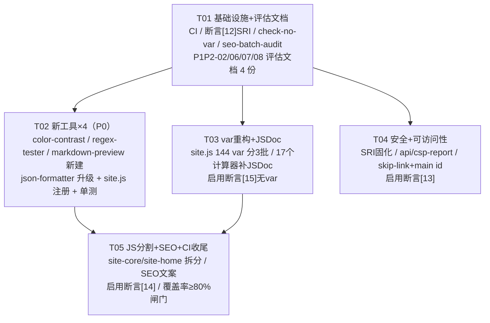
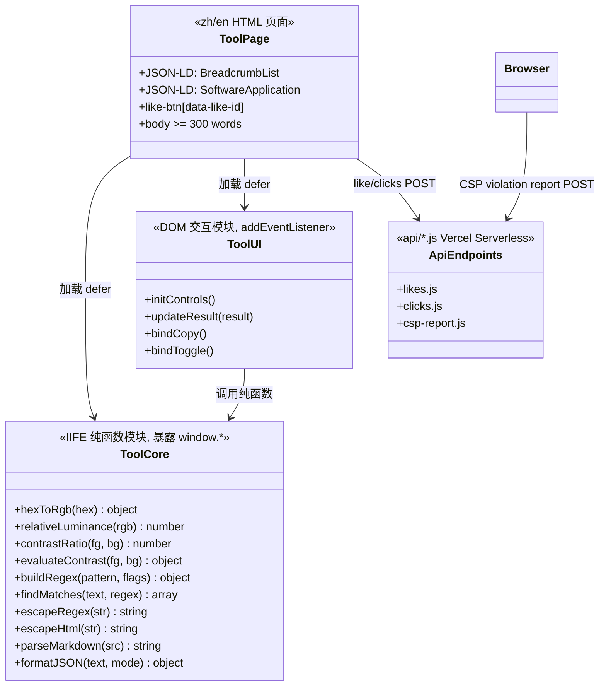
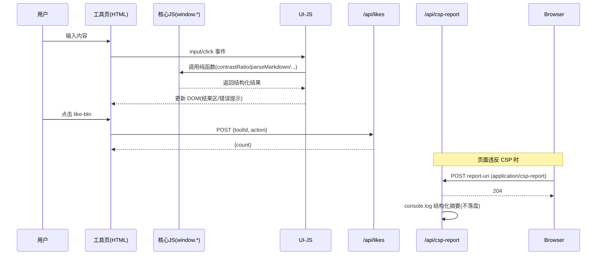

# calc-tools.top P1+P2 增量架构设计与任务分解

**版本**：v1.0（2026-08-23）
**作者**：高见远（Gao，架构师）
**上游输入**：`deliverables/p1p2-incremental-prd.md`（v1.0）
**基线事实（已核验）**：
- 站点 184 页（含 80 博客）/ 43 工具 / 中英双语；verify-site 现有 11 断言全绿；CSP 硬化完成（无 unsafe-inline）。
- `js/site.js` 实际 var 计数 = **144**（与 PRD 一致）；`js/calculators/` 24 个文件中 **7 个已有 JSDoc**（calorie-calculator / housing-fund / mortgage / password-strength / password-strength-ui / tax2026 / workday-calculator），**17 个缺失**（以实际为准，与 PRD"19 个缺失"略有出入）。
- site.js 的加载范围与 PRD 描述有细微出入：**calculators 工具页一律不引 site.js**（新标杆模式），site.js 实际加载于：首页、en 首页、博客索引页、全部博客正文页、7 个 text 工具页。拆分设计据此校准。
- SRI 主体已完成：Chart.js@4.4.9 / qrcodejs@1.0.0 已带 integrity+crossorigin，本轮仅需断言固化。
- 项目无 package.json；node --test + Node 22 --test-coverage 为既定路线（不引入 npm 依赖）。

---

## 1. TL;DR

本轮把 13 个需求项（9 执行 + 4 评估）收敛为 **5 个有序任务（T01~T05）**：先立基础设施与断言基线（CI / 审计脚本 / 4 份评估文档），再交付 4 个新工具（P0），随后做 var 重构 + JSDoc 清障，再做安全与可访问性硬化，最后做 JS 分割 + SEO 收尾 + 覆盖率闸门，全程以「build → verify-site → node --test → 浏览器冒烟」为回归协议，CSP 断言保持全绿。

---

## 2. 任务依赖图

依赖说明：
- T01 为所有任务的地基（CI、审计脚本、断言编号骨架）。
- T05（JS 分割）**必须**在 T03（var 重构）之后，避免回归叠加（PRD 决策 3）。
- T05 的覆盖率阈值闸门依赖 T02 的新工具单测。
- T02 / T03 / T04 彼此无强依赖，单工程师串行执行，也可在 T01 后并行。

---

## 3. 文件清单表

### P1P2-01 SEO 批量审计 + 重点页优化（P0，执行）

| 文件路径 | 新建/修改 | 说明 |
|---|---|---|
| `scripts/seo-batch-audit.mjs` | 新建 | 批量审计：title 长度 30-60 / description 50-160 / 重复 title=0 / 占位符检测 / 每工具页内链数≥3；输出报告并供 verify-site [14] 复用 |
| `scripts/verify-site.mjs` | 修改 | 新增断言 [14]（T05 启用）：全站 title 存在率 100%、重复 title=0 |
| `index.html`、`en/index.html` | 修改 | 首页 title/description 文案优化（CTR 向） |
| 43 个工具页（`zh/calculators/*.html`、`zh/text/*.html`、`zh/image/*.html` + en 对应页） | 修改 | 重点页 title/description 批量优化；每工具页补足 ≥3 条站内内链（相关工具/博客，由 seo-batch-audit 复核） |
| 4 个新工具页 + password-strength（T02 一并落地） | 修改 | 新工具页 SEO 文案随 T02 直接达标，不单独回改 |

### P1P2-02 Google News 评估（P2，评估文档）

| 文件路径 | 新建/修改 | 说明 |
|---|---|---|
| `deliverables/p1p2-google-news-eval.md` | 新建 | ≤1 页结论文档：内容类型（工具站 + 低频工具向博客）不符合 Google News 新闻政策 → **结论：不满足→不做**；替代方案：Google Discover 优化、NewsArticle 结构化数据评估、常规索引（sitemap 已提交） |

### P1P2-03 新工具 ×4（P0，执行）

| 文件路径 | 新建/修改 | 说明 |
|---|---|---|
| `zh/calculators/color-contrast.html` | 新建 | 颜色对比度检查器（zh），对齐 password-strength 标杆：核心/UI-JS 分离、JSON-LD×2、like-btn、正文≥300 词、无内联 |
| `en/calculators/color-contrast.html` | 新建 | 同上（en），canonical + hreflang zh-CN/en/x-default |
| `js/calculators/color-contrast.js` | 新建 | 核心纯函数 IIFE + 暴露 window：`hexToRgb` / `relativeLuminance` / `contrastRatio` / `evaluateContrast`（WCAG 相对亮度公式 + AA/AAA 判定） |
| `js/calculators/color-contrast-ui.js` | 新建 | DOM 交互（addEventListener，无内联事件） |
| `zh/calculators/regex-tester.html` | 新建 | 正则表达式测试器（zh） |
| `en/calculators/regex-tester.html` | 新建 | 同上（en） |
| `js/calculators/regex-tester.js` | 新建 | 核心纯函数：`buildRegex` / `findMatches` / `explainGroups` / `escapeRegex`（本地实现，零第三方库 → CSP 白名单不扩张） |
| `js/calculators/regex-tester-ui.js` | 新建 | DOM 交互 + 匹配高亮（**textContent/DOM 构建，禁 innerHTML 注入匹配文本，防 XSS**） |
| `zh/calculators/markdown-preview.html` | 新建 | Markdown 预览器（zh） |
| `en/calculators/markdown-preview.html` | 新建 | 同上（en） |
| `js/calculators/markdown-preview.js` | 新建 | 核心纯函数：`escapeHtml` / `parseMarkdown`（**先 escape 后语法替换**；基础子集：标题/粗斜体/行内代码/围栏代码块/列表/链接/引用/分隔线/表格） |
| `js/calculators/markdown-preview-ui.js` | 新建 | 编辑器 + 实时预览 DOM 交互 |
| `zh/text/json-formatter.html` | 修改 | **升级现有页，不新建**：正文扩至 ≥300 词、JSON-LD 复核（已有 BreadcrumbList+FAQPage+SoftwareApplication，达标）、like-btn 确认、like.js 加载位置统一至 head |
| `en/text/json-formatter.html` | 修改 | 同上（en）双语完善 |
| `js/text-tools/json-formatter.js` | 修改 | 错误定位增强：formatJSON 错误时返回 `context`（错误位置前后 ~80 字符片段）等新字段；保持既有返回结构兼容；暴露 `window.formatJSON` 供单测 |
| `js/site.js` | 修改 | **三处注册（易漏）**：`SITE_CONFIG.tools` + `TOOLS_DATA` + `TOOL_KEYWORDS_ZH` 新增 color-contrast / regex-tester / markdown-preview（json-formatter 已有） |
| `api/allowed-ids.js` | 修改 | `node scripts/gen-allowed-ids.js .` 重生成，新增 3 个 TOOL_IDS |
| `sitemap.xml` | 修改 | 重生成，新增 8 条 URL（4 工具 × 2 语言） |
| `js/test/color-contrast.test.js` | 新建 | 核心函数单测 ≥5 用例（P1P2-13 联动） |
| `js/test/regex-tester.test.js` | 新建 | 同上 |
| `js/test/markdown-preview.test.js` | 新建 | 同上（含 XSS 转义用例） |
| `js/test/json-formatter.test.js` | 新建 | formatJSON ≥5 用例（format/minify/错误行列/context/暴露） |

### P1P2-04 SRI 断言固化（P1，执行）

| 文件路径 | 新建/修改 | 说明 |
|---|---|---|
| `scripts/verify-site.mjs` | 修改 | 新增断言 [12]（T01 启用）：dist 中所有 `src` 含 `cdn.jsdelivr.net` 的 `<script>` 均带非空 `integrity` 且 `crossorigin="anonymous"` |
| `scripts/verify-site.mjs`（注释） | 修改 | 记录结论：AdSense/GA4 为 Google 动态脚本，哈希不稳定，**不适用 SRI**（加 SRI 会导致加载失败） |

### P1P2-05 CSP report 端点（P1，执行）

| 文件路径 | 新建/修改 | 说明 |
|---|---|---|
| `api/csp-report.js` | 新建 | Vercel Serverless，参照 `api/likes.js` 模式：origin 白名单 CORS / 每 IP 写限速 20/min / body≤16KB / POST 204 / 非法 400 / 超限 429；仅 `console.log` 结构化摘要（不落盘敏感数据） |
| `api/test/csp-report.test.js` | 新建 | node:test 零依赖：模拟 req/res 断言 204/400/405/429（clicks.test.js 先例） |
| `vercel.json` | 修改 | CSP 强制头末尾追加 `; report-uri /api/csp-report`（不影响现有 9 项 CSP 断言） |

### P1P2-06 / 07 WebP 与图片 CDN（P2，评估文档）

| 文件路径 | 新建/修改 | 说明 |
|---|---|---|
| `deliverables/p1p2-image-strategy.md` | 新建 | ≤1 页：assets 仅 favicon.svg / logo.svg / logo-h.svg（全站 SVG，无位图）→ **结论：WebP 转换与图片 CDN 均不做**；未来位图规范 = WebP + width/height + loading=lazy（已有 lazy 断言兜底） |

### P1P2-08 关键 CSS 内联（P2，评估文档，本轮不实施）

| 文件路径 | 新建/修改 | 说明 |
|---|---|---|
| `deliverables/p1p2-critical-css-plan.md` | 新建 | ≤1 页：critical.css 拆分策略 + CSP hash 方案（构建时计算 sha256 加入 style-src，保持无 unsafe-inline）+ **记录当前 Lighthouse 基线**（移动端 Performance 分数，作为后续对比锚点）；本轮不实施 |

### P1P2-09 JS 代码分割（P2，执行，依赖 T03）

| 文件路径 | 新建/修改 | 说明 |
|---|---|---|
| `js/site-core.js` | 新建 | 全站必需：`initBackToTop` / `initReadingProgress` / `initTagClicks` / like 委托访问器 `getLikes` `saveLikes` `getTotalLikes`（约 60 行） |
| `js/site-home.js` | 新建 | 首页/列表页专用：`SITE_CONFIG` / `TOOLS_DATA` / `TOOL_KEYWORDS_ZH` / `DEFAULT_HOT_TOOLS` / 点击与搜索追踪 / 分类筛选 / 博客分页 / 热门工具排序（原 site.js 其余全部） |
| `index.html`、`en/index.html` | 修改 | `site.js` → `site-core.js` + `site-home.js` |
| `blog/zh/index.html`、`blog/en/index.html` | 修改 | `site.js` → `site-core.js` + `site-home.js`（列表页保留分页/文章点击功能） |
| 博客正文页（~78 个） | 修改 | `site.js` → `site-core.js`（阅读进度/返回顶部/标签跳转）——用批量脚本替换 |
| 7 个 text 工具页（word-counter/url-encode/text-diff/text-cleaner/reading-time/html-stripper/keyword-density，zh+en） | 修改 | `site.js` → `site-core.js`（返回顶部；其余功能因 DOM 不存在自动降级） |
| `scripts/replace-site-js.mjs` | 新建 | 批量替换上述页面 script 标签（幂等，只改 site.js 引用） |
| `scripts/build.mjs` | 修改 | `ASSET_RE` 扩展支持 site-core/site-home 版本注入（见 §5.2） |
| `js/site.js` | 删除/留空壳 | 拆分完成后删除（git rm 禁用：`rm js/site.js && git add -A js/site.js`）；若担心同步盘回滚可留注释空壳，二选一 |

### P1P2-10 可访问性 WCAG 2.1 AA（P1，执行）

| 文件路径 | 新建/修改 | 说明 |
|---|---|---|
| `includes/header-zh.html` | 修改 | 模板首元素加 `<a class="skip-link" href="#main">`（zh 文案） |
| `includes/header-en.html` | 修改 | 同上（en 文案） |
| `scripts/add-main-id.mjs` | 新建 | 全站 184 页 `<main>` → `<main id="main">`（幂等批量脚本；header 改动经 verify-site [1] 字节一致性自动传播验证） |
| `css/style.css` | 修改 | `.skip-link` 样式（默认移出视口、聚焦可见）+ 全局 `:focus-visible` 可见焦点样式 |
| `scripts/verify-site.mjs` | 修改 | 新增断言 [13]（T04 启用）：每页 `<main id="main">` + skip-link；dist 无「无关联 label 的 input/select/textarea」；所有 `<button>` 有可访问名 |
| `deliverables/p1p2-screen-reader-test-template.md` | 新建 | 读屏实测报告模板（首页 + 1 工具页 + 1 博客页），实测由用户/QA 操作（P1P2-10d） |

### P1P2-11 site.js var→const/let（P1，执行）

| 文件路径 | 新建/修改 | 说明 |
|---|---|---|
| `js/site.js` | 修改 | 144 处 var 分 3 批重构（每批 ~50 处，见 §5.1 hoisting 敏感点清单）；**不改任何行为语义** |
| `scripts/check-no-var.mjs` | 新建 | `\bvar\s` 计数 js/site.js，>0 退出码非 0（T01 建） |
| `scripts/verify-site.mjs` | 修改 | 新增断言 [15]（T03 启用）：调用 check-no-var.mjs，site.js 无 var |

### P1P2-12 计算器 JSDoc（P2，执行）

| 文件路径 | 新建/修改 | 说明 |
|---|---|---|
| `js/calculators/age-calc.js`、`bmi.js`、`car-loan.js`、`compound-interest.js`、`date-calc.js`、`discount.js`、`electricity.js`、`fuel-cost.js`、`ideal-weight.js`、`loan-compare.js`、`overtime.js`、`ovulation.js`、`password-gen.js`、`percentage-calc.js`、`qr-generator.js`、`random-gen.js`、`unit-converter.js` | 修改（17 个） | 补文件级 + 顶层函数级 JSDoc（@param/@returns/@throws），**不改逻辑** |

### P1P2-13 测试覆盖 + CI（P1，执行）

| 文件路径 | 新建/修改 | 说明 |
|---|---|---|
| `.github/workflows/ci.yml` | 新建 | push 触发：build.mjs → verify-site.mjs → `node --test` → 覆盖率阈值（T05 加入 ≥80% 闸门） |
| `js/test/*.test.js`（4 个新工具） | 新建 | 见 P1P2-03（T02 落地） |
| `api/test/csp-report.test.js` | 新建 | 见 P1P2-05（T04 落地） |
| `.github/workflows/ci.yml` | 修改 | T05：加 `node --test --test-coverage --test-coverage-lines=80 ...`（Node 22.14+；若版本不支持则脚本解析覆盖率输出断言 lines≥80） |

---

## 4. 实现顺序（有序任务列表，含每步验证命令）

### T01 基础设施 + 评估文档（P1P2-01 脚本 / 04 断言 / 02 / 06 / 07 / 08）
**文件**：`.github/workflows/ci.yml`、`scripts/verify-site.mjs`（断言[12]）、`scripts/check-no-var.mjs`、`scripts/seo-batch-audit.mjs`、`deliverables/p1p2-google-news-eval.md`、`deliverables/p1p2-image-strategy.md`、`deliverables/p1p2-critical-css-plan.md`

1. 新建 CI（build → verify-site → node --test；覆盖率闸门 T05 再加）。
2. verify-site 新增断言 [12] SRI（应即刻全绿）+ 预留 [13][14][15] 编号注释。
3. 新建 check-no-var.mjs、seo-batch-audit.mjs 并跑通输出报告。
4. 产出 3 份评估文档（Google News / 图片策略 / critical CSS 方案 + Lighthouse 基线）。

**验证**：`node scripts/build.mjs && node scripts/verify-site.mjs`（全绿）；`node --test`（既有 like/api 测试通过）；`node scripts/seo-batch-audit.mjs`（输出报告，重复 title 现状作为 T05 前置数据）。

### T02 新工具 ×4（P1P2-03 + 13 单测 + 01 新页文案）
**文件**：§3 P1P2-03 全表（22 个文件）

1. 按 password-strength 标杆建 3 个新工具（每工具：zh/en HTML + 核心 JS + UI JS + 单测），核心 JS 与 UI JS 分离、无内联、JSON-LD（BreadcrumbList + SoftwareApplication）、like-btn、正文 ≥300 词。
2. 升级 json-formatter（zh/en 页面 + 错误定位增强 + 暴露 window.formatJSON + 单测）。
3. site.js 三处注册 + `gen-allowed-ids.js` 重生成 + sitemap 重生成。

**验证**：`node scripts/build.mjs && node scripts/verify-site.mjs`（含 check-jsonld 5 断言、check-links）；`node --test`（4 个新单测文件全过）；`node scripts/measure-content.mjs`（4 工具页 ≥300 词）；浏览器冒烟 4 工具：控制台 0 error、格式化/匹配/预览交互正常、点赞 +1、双语切换。

### T03 var 重构 + JSDoc（P1P2-11 + 12）
**文件**：`js/site.js`、`scripts/verify-site.mjs`（启用[15]）、17 个计算器 JS

1. 按 §5.1 敏感点清单分 3 批改 site.js（批 1：L61-282；批 2：L350-683；批 3：L640-910 尾段），每批独立 commit。
2. 每批后启用/复跑断言 [15]。
3. 17 个计算器补 JSDoc（机械性）。

**验证（每批）**：`node scripts/check-no-var.mjs && node scripts/build.mjs && node scripts/verify-site.mjs`；浏览器冒烟：首页（分类筛选/搜索/热门工具/点赞）、1 博客页、3 工具页控制台 0 error、核心功能可用。末批后全站 0 var。

### T04 安全 + 可访问性（P1P2-04 固化 / 05 / 10）
**文件**：`api/csp-report.js`、`api/test/csp-report.test.js`、`vercel.json`、`includes/header-{zh,en}.html`、`scripts/add-main-id.mjs`、`css/style.css`、`scripts/verify-site.mjs`（启用[13]）、`deliverables/p1p2-screen-reader-test-template.md`

1. api/csp-report.js + 单测 + vercel.json report-uri。
2. header 模板加 skip-link；add-main-id.mjs 批量补 `<main id="main">`；style.css 加 skip-link + :focus-visible。
3. verify-site 启用断言 [13]。

**验证**：`node --test`（含 csp-report.test.js）；`node scripts/build.mjs && node scripts/verify-site.mjs`（断言 1 header 字节一致 + 13 全绿）；手动触发一次 CSP violation（浏览器控制台）确认 Vercel 日志收到 /api/csp-report 请求；`node scripts/add-main-id.mjs --check`（幂等复查）。

### T05 JS 分割 + SEO + CI 收尾（P1P2-09 + 01 + 13 阈值）
**文件**：`js/site-core.js`、`js/site-home.js`、`scripts/replace-site-js.mjs`、`index.html`、`en/index.html`、`blog/{zh,en}/index.html`、博客正文页 ×78、7 个 text 工具页、`scripts/build.mjs`（ASSET_RE）、`scripts/verify-site.mjs`（启用[14]）、`.github/workflows/ci.yml`（覆盖率阈值）、43 工具页 + 首页 SEO 文案

1. 从 site.js 拆出 site-core.js / site-home.js（函数归属见 §3 P1P2-09），replace-site-js.mjs 批量替换页面引用，build.mjs ASSET_RE 扩展。
2. SEO 重点页文案（首页 + 43 工具页 title/description + 内链补足）。
3. CI 加覆盖率阈值；verify-site 启用断言 [14]。

**验证**：`node scripts/build.mjs && node scripts/verify-site.mjs`（断言 1/12/13/14/15 全绿）；dist 机检：首页含 site-core+site-home、工具页仅 site-core（或不含）；`node --test --test-coverage` 覆盖率 ≥80%；首页 + 3 代表工具页浏览器冒烟 0 error；push 后 GitHub Actions 全绿。

---

## 5. 关键设计决策

### 5.1 var 重构 hoisting 敏感点清单（site.js，具体行号）

| # | 位置 | 风险 | 规避指令 |
|---|---|---|---|
| A | `initHotTools` 内 `var selected`（L640 if 分支 + L658 else 分支，L661 分支后使用 `selected.length`） | **最高**。两分支各声明一次 var（函数级同一绑定），分支后仍使用。若两处都改 `const` → 块级重复声明 SyntaxError 或 L661 ReferenceError | 改为：`let selected;` 声明于 if 之前，两分支内仅 `selected = ...` 赋值。分支内的 `var rescored`（L645）仅 else 内使用，可安全改 `const rescored` |
| B | 顶层 `var _globalClickTotals = {}`（L586）被 L169（incrementClick 内赋值）、L638/L649（initHotTools）、L715/L716（initToolSort）引用，且**声明在使用之后** | 中。var 提升使其可用；改 const/let 后有 TDZ 语义 | 可安全改 `const _globalClickTotals = {}`——所有使用均在函数内且于 DOMContentLoaded/pageshow 后执行（此时 const 已初始化）。**禁止**新增 L586 之前执行的顶层代码引用它；**禁止**下移声明 |
| C | `renderHotSearch` for 循环 `var i`（L828）+ IIFE 捕获（L829-840） | 低。IIFE 正是为绕开 var 捕获问题而写 | 改 `let i` 安全；IIFE 可保留（行为不变）或顺手删除，无回归 |
| D | for 循环计数器 `var i/j/k`（L62、L206、L216、L217、L246、L484、L739） | 低。已逐处核对：循环结束后同函数内无引用 | 统一改 `let`（保持循环局部语义，与既有 `for...of` 风格一致） |
| E | 其余 ~130 处函数内单次声明 var | 低 | 按「是否有再赋值」定：仅赋值一次 → `const`；多次赋值 → `let`。例：`getTrendLabel` 的 `trend`（L209）/`sum`（L205）→ let；`todayCount`（L200）→ const |
| F | 不同函数内同名 var（`key` L81/L86、`items` L730/L738、`terms` L258/L265/L818、`clicks` L155/L181/L192/L197/L619、`trend` L209/L276、`wrap` L99/L432/L330） | 无。各自函数作用域隔离 | 分别按需处理，互不影响 |
| G | 外部 API 面 | 无。已核验：无任何 `data-csp-click/data-csp-change` 属性引用 site.js 函数（switchLang 属 i18n.js、json-formatter 的 doFormat/switchJSONMode 属 text-tools/json-formatter.js） | 重构完全限定在 site.js 文件内部，不触碰 window 暴露的函数名/签名 |

**批次划分**：批 1 = L61-282（tag/like 委托/click 追踪/trend）；批 2 = L350-683（分类筛选/搜索热词/趋势渲染/fetchAndMerge/initHotTools 前段）；批 3 = L640-910（initHotTools 后段含敏感点 A、initToolSort/initBlogPagination/initSearch/renderHotSearch/initReadingProgress/initBackToTop）。每批末尾跑 `check-no-var.mjs` 确认递减。

### 5.2 site.js 拆分后 ASSET_RE 与版本注入

- 现 `scripts/build.mjs` L220：
  `ASSET_RE = /(["'])([^"']*?)((?:site|like|i18n)\.js|css\/style\.css)(\?v=[^"']*)?\1/g`
- 改为：
  `ASSET_RE = /(["'])([^"']*?)((?:site(?:-core|-home)?|like|i18n)\.js|css\/style\.css)(\?v=[^"']*)?\1/g`
- 关键点：`site(?:-core|-home)?` 必须整体匹配，否则旧正则会把 `site-core.js` 里的 `site` 误判；替换后 `site-core.js` 与 `site-home.js` 均注入 `?v=STAMP`，幂等逻辑不变（已带 ?v 统一覆盖为当前 STAMP）。
- 页面引用规则：首页 + 博客索引 = `site-core.js` + `site-home.js`；博客正文 + text 工具页 = `site-core.js`；calculators 工具页 = 不引（现状不变）。

### 5.3 csp-report 端点结构（参照 api/likes.js 的 allowed-ids 模式）

- `api/csp-report.js` 导出 `async function handler(req, res)`，复用 likes.js 的骨架：
  - CORS：`ALLOWED_ORIGINS` 白名单 + `Access-Control-Allow-Origin/Methods/Headers` + `OPTIONS 200`；`Cache-Control: no-store`。
  - 限速：`isRateLimited(ip, isRead=false)`，key 前缀 `ratelimit:csp:`，写配额 20/min；超限 429。
  - 入参：仅接受 `POST`（GET → 405）；`readBody` 上限 **16KB**（CSP 报告体比点赞大）；`Content-Type` 含 `application/csp-report` 或 `application/json` 均放行，直接 `JSON.parse`，失败 → 400。
  - 记录：**不落盘敏感数据**——`console.log('[csp-report]', JSON.stringify({ ts, ip, disposition, directive, blockedURI, sourceFile, line, column }))`（Vercel 函数日志即观测面；本轮不做 KV 计数，保持简单）。
  - 返回：成功 **204 无 body**；400/405/413/429 带 JSON error。
- `vercel.json` CSP 强制头末尾追加 `; report-uri /api/csp-report`；不影响现有断言 9（只查 script-src 指令）。
- 单测 `api/test/csp-report.test.js`：直接 require handler + 模拟 req/res（node:test，clicks.test.js 先例），断言 204 / 400 / 405 / 413 / 429。

### 5.4 verify-site 新增断言编号规划（12→15）

| 编号 | 对应需求 | 内容 | 启用时机 |
|---|---|---|---|
| [12] | P1P2-04 | dist 中 `src` 含 cdn.jsdelivr.net 的 `<script>` 均带非空 `integrity` + `crossorigin="anonymous"`；注释记录 AdSense/GA4 不适用 SRI 的原因 | T01（应即刻绿） |
| [13] | P1P2-10 | 每页 `<main id="main">` + `<a class="skip-link" href="#main">`；dist 无「无关联 label 的 input/select/textarea」；所有 `<button>` 有可访问名 | T04 |
| [14] | P1P2-01 | 全站 title/description 存在率 100%、重复 title=0、无占位符 | T05（需先用 seo-batch-audit 确认现状为 0 再启用） |
| [15] | P1P2-11 | `js/site.js` 中 `\bvar\s` 计数 = 0（复用 check-no-var.mjs） | T03 |

---

## 6. 风险与规避

| 风险 | 说明 | 规避 |
|---|---|---|
| **var 重构回归** | 144 处 var，敏感点 A/B（见 §5.1）若机械替换将造成 initHotTools 空引用（ReferenceError）或重复声明报错 | 严格遵守 §5.1 清单；3 批独立 commit；每批 verify-site + 浏览器冒烟；check-no-var 断言兜底；**同批内绝不混入其他逻辑改动** |
| **hidden class 陷阱** | 新工具页含隐藏元素（regex-tester 结果区 / markdown-preview 预览区 / color-contrast 结果区）——CSS 有 `.hidden{display:none!important}`，JS 若用 `style.display` 切换必挂（08-23 教训） | 新工具 HTML 直接写 `class="hidden"`，JS 用 `classList.toggle('hidden')`；**禁用 `style.display`**；build.mjs 的 inlineNoneToHidden 卫生转换作为兜底 |
| **CSP 断言保持全绿** | 新工具无内联 script/事件；markdown-preview 不引第三方库（避免白名单扩张）；regex-tester 匹配高亮若用 innerHTML 注入匹配文本，既有 img-src/script-src 虽不拦但引入 XSS | 新工具 UI 一律 addEventListener；markdown/regex 输出先 `escapeHtml`/textContent；verify-site [7][8][9] 每任务后必跑 |
| **site.js tools 注册遗漏** | 新工具漏注册三处之一 → 首页网格不显示 / 搜索不到 / 点赞 403 | T02 完成节点检查：SITE_CONFIG.tools + TOOLS_DATA + TOOL_KEYWORDS_ZH 三处 + `gen-allowed-ids.js` 重生成 + 首页冒烟看到新工具卡片 |
| **header 模板改动传播** | skip-link 进 header 模板后，184 页 header 必须同步，否则 verify-site [1] 字节一致性红 | 用 add-main-id.mjs / normalize-template.mjs 批量传播；改前 `git fetch origin main && git reset --hard origin/main`（百度同步盘回滚防护） |
| **ASSET_RE 匹配顺序** | site-core.js / site-home.js 若不被新正则匹配 → 版本号不注入 → 浏览器缓存旧 JS | §5.2 正则；build 后抽查 dist 首页 script 标签带 `?v=STAMP` |
| **json-formatter 升级回归** | 已在生产的页面；改动错误定位可能破坏现有 UI 引用 | formatJSON 保持 `{success,result,size,originalSize,error,line,col}` 兼容，`context` 为新增可选字段；单测覆盖；升级后浏览器冒烟 |
| **覆盖率闸门过早启用致 CI 红** | 当前仅 like/api 少量测试，覆盖率远低于 80% | 阈值在 T05 才加入 CI；T02 新工具单测先落地 |
| **CSP report-uri 兼容** | 现代浏览器偏好 report-to，但 report-uri 仍被 Chrome/Firefox/Safari 支持 | 本轮仅 report-uri（PRD 决策）；report-to 留作未来项 |

---

## 7. 待明确事项（≤3）

1. **读屏实测（P1P2-10d）**：本轮交付自动断言 + 报告模板（`deliverables/p1p2-screen-reader-test-template.md`），NVDA/VoiceOver 实测结果需用户/QA 提供，不阻塞其余验收。
2. **断言 [14] 启用前置**：seo-batch-audit 首跑若发现现存重复 title（>0），需在 T05 先修复再启用断言 [14]，避免 CI 中间态变红；若首跑即为 0，则直接启用。
3. **markdown-preview 语法子集范围**：默认实现「标题/粗斜体/行内代码/围栏代码块/有序无序列表/链接/引用/分隔线/表格」；如需任务列表/图片语法，请在 T02 开工前确认（影响核心函数与单测用例数）。

---

## 附录 A：新工具模块结构（classDiagram）

## 附录 B：关键调用流（sequenceDiagram）

