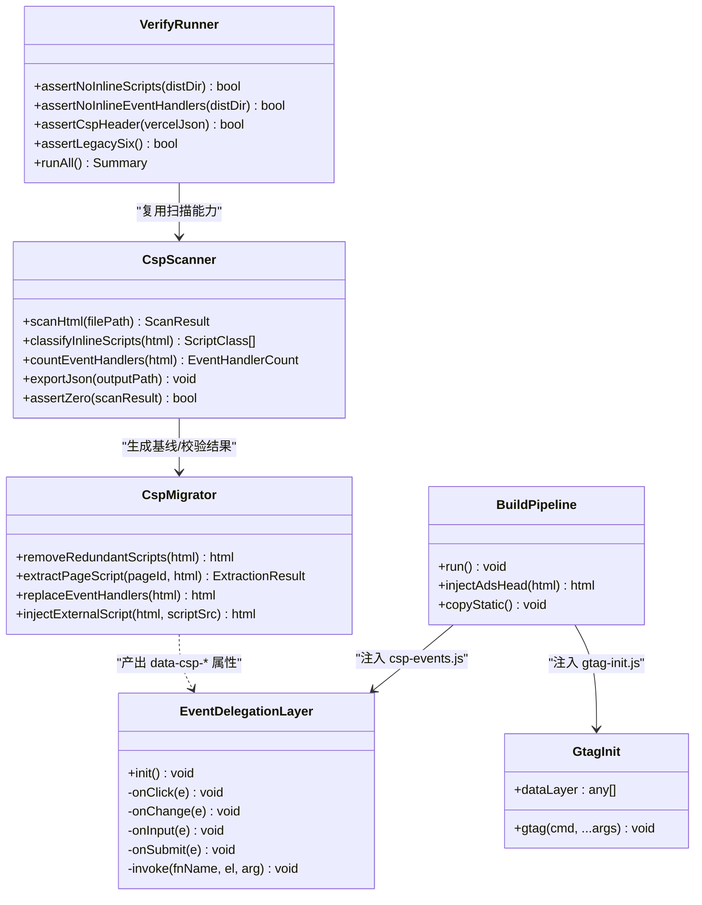
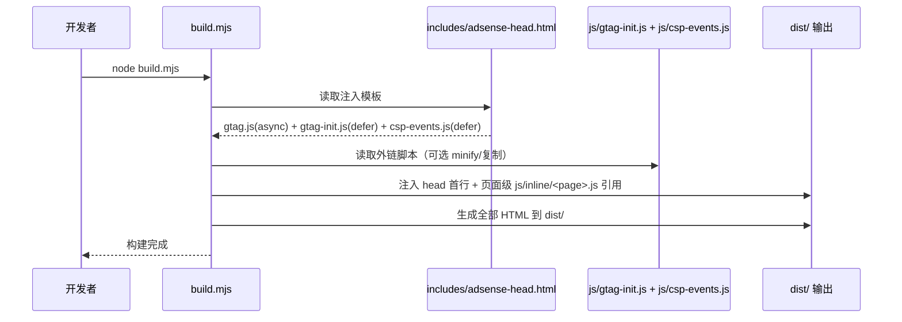
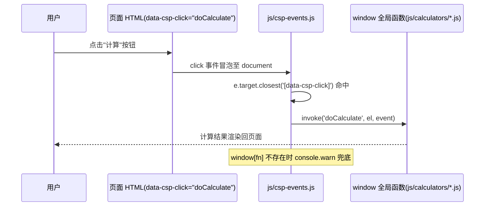
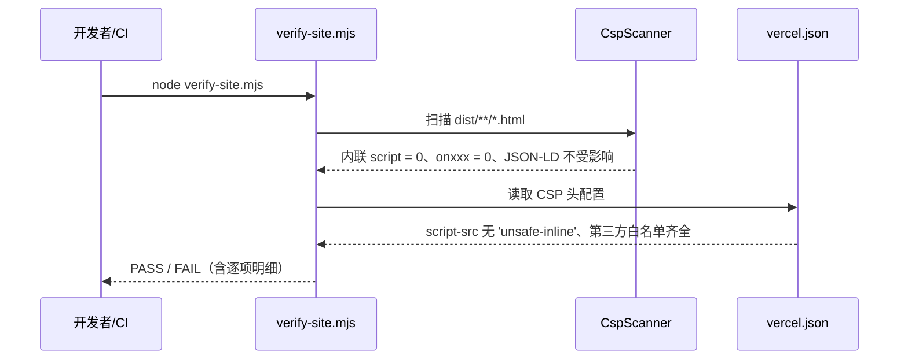
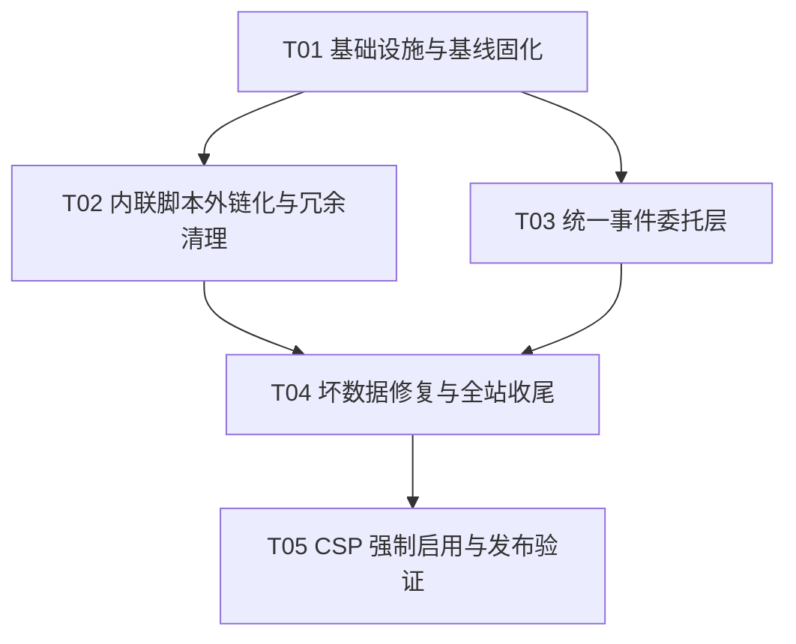

# calculator-site CSP 迁移架构设计（Architecture & Task Decomposition）

> 作者：高见远（software-architect-2）｜日期：2026-08-22
> 基线来源：`docs/csp-inline-scan.json`（2026-08-22 实测，**优先于**旧计划文档 `docs/CSP-migration-plan.md`）
> 目标：移除 `script-src 'unsafe-inline'`，将全部可执行内联脚本与内联事件处理器外链化/委托化，CSP 先 report-only 灰度、后强制启用，全程可验证、可回滚。

---

## Part A：系统设计

### 1. 实施方案（Implementation Approach）

#### 1.1 技术难点分析

| # | 难点 | 实测规模 | 对策 |
|---|------|---------|------|
| 1 | 可执行内联 `<script>` 外链化 | 55 个（10 种唯一模式），其中 **40 个是冗余可直接删除** | 按"删除冗余 + 抽取页面专属"双轨处理 |
| 2 | 内联事件处理器 `onxxx=` 迁移 | 418 个（Top: switchLang 174 / resetForm 42 / doCalculate 36） | 统一 `data-csp-*` 属性 + document 级事件委托 |
| 3 | GA4 内联 config 与 async 加载顺序 | 1 块（`includes/adsense-head.html:4-9`，build 注入全站 173 页） | 外链化 `js/gtag-init.js`，利用 dataLayer 队列机制保证 config 不丢失 |
| 4 | 百度同步盘 CRLF / 回滚文件 | 全站 HTML 可能被注入 CRLF | Node/Python 作为最终写入者保 LF；`git` 独立提交 + `.gitattributes` 兜底 |
| 5 | 灰度与回滚 | — | CSP 先 Report-Only 后强制；vercel.json 单行注释即可回退 |
| 6 | JSON-LD / `<style>` 干扰 | JSON-LD 232 个（CSP 不限制）、style= 462 个 | 本期不处理；style-src 暂留 `'unsafe-inline'` |

#### 1.2 框架与库选型

- **不引入任何前端框架 / 第三方库**。站点为纯静态多语言站，全部迁移工作基于原生 DOM API，保持零新增运行时依赖，降低 CSP 白名单膨胀风险。
- **迁移工具**：Node 脚本（与 `build.mjs` / `verify-site.mjs` 同技术栈，避免 Python 双栈；正则 + 简单状态机足够）。
- **事件委托**：原生 `document.addEventListener`（capture 冒泡阶段），无第三方库。
- **图表**：沿用 Chart.js（`cdn.jsdelivr.net` 已在白名单）。
- **架构模式**：本质是"**页面脚本外置 + 集中事件绑定**"模式——HTML 只保留结构与数据属性，行为全部收敛到外部脚本；事件处理通过 document 级委托层 `js/csp-events.js` 统一路由到 window 全局函数。

#### 1.3 关键设计决策

**D1：统一 `data-csp-*` 属性委托机制（替代逐元素 addEventListener）**
- 所有内联事件处理器统一替换为数据属性：`onclick="resetForm()"` → `data-csp-click="resetForm"`，`onchange="switchLang(this.value)"` → `data-csp-change="switchLang"`，`onsubmit="return false;"` → `data-csp-submit="prevent"`，`oninput="scheduleDiff()"` → `data-csp-input="scheduleDiff"`。
- 理由：① 可脚本化批量替换（418 处一次完成）；② 可被扫描器**机械验证**（`onxxx` 计数归零 + `data-csp-*` 计数一致）；③ 委托逻辑集中在一个文件，便于审查；④ 低频 2x 模式（switchMode/switchBase64Mode/calcModeA/clearTool 等）同样适用，无需逐元素写样板代码。
- 低频模式的**函数实现**按要求归入页面专属 `js/inline/<page>.js`（不留在 HTML）。

**D2：gtag 外链化方案（解决 async 顺序）**
- `includes/adsense-head.html` 保留 `<script async src="https://www.googletagmanager.com/gtag/js?id=G-B61D908J5F"></script>`；内联 config 块替换为 `<script src="/js/gtag-init.js" defer></script>`。
- `js/gtag-init.js` 内容（标准 gtag 引导）：
  ```js
  window.dataLayer = window.dataLayer || [];
  function gtag(){ dataLayer.push(arguments); }
  gtag('js', new Date());
  gtag('config', 'G-B61D908J5F');
  ```
- **顺序论证**：`dataLayer` 本质是命令队列。无论 `gtag.js`（async）先于还是后于 `gtag-init.js`（defer）执行，`gtag.js` 加载后都会回放队列中的 `config` 命令，因此 config 不会丢失；`gtag-init.js` 的 `defer` 仅要求其在 HTML 解析完成后执行，天然满足。

**D3：事件委托绑定时机**
- 业务脚本（`js/calculators/*.js`、`js/inline/*.js`）全部 `defer`，在 `DOMContentLoaded` 前按序执行完毕，故 `js/csp-events.js` 将**所有绑定放在 `DOMContentLoaded` 回调内**执行，不依赖脚本注入顺序。
- `js/csp-events.js` 统一在 `includes/adsense-head.html` 中引入（`defer`），随 build 注入全站，保证所有页面生效。

**D4：55 个内联脚本处置矩阵**

| 模式 | 数量 | 处置 |
|------|------|------|
| i18n DOMContentLoaded 初始化（data-i18n） | 20 | **直接删除**（`js/i18n.js:253-259` 已有等价逻辑） |
| 旧版点赞 IIFE（toolbox_likes） | 20 | **直接删除**（`js/like.js` 唯一实现，`window.LikeSystem` 自动初始化，含 `data-initialized` 幂等守卫） |
| Chart.js 页面逻辑（chartInstance+formatNumber） | 6 | 抽取 → `js/inline/<page>.js` |
| toggleMode() | 2 | 抽取 → `js/inline/date-calc.js`（确认 `js/calculators/date-calc.js` 无此函数） |
| unit-converter 初始化（updateUnits+doConvert） | 2 | 确认 `js/calculators/unit-converter.js` 是否已有；无则抽取 → `js/inline/unit-converter.js` |
| `<data-i18n>` 乱码变体 | 2 | **检查原文件**，修复为正常 UTF-8（T04） |
| GA4 初始化（gtag config） | 1 | 外链化 → `js/gtag-init.js`（见 D2） |
| chartInstance+getCategoryLabel 正常版 | 1 | 抽取 → `js/inline/<page>.js`（含中文"偏瘦"） |
| chartInstance+getCategoryLabel 乱码版 | 1 | **先修复乱码（ƫ$$，疑似旧编码残留）**再抽取（T04 处理，T02 中先占位删除） |
| **合计** | **55** | 删除 40 + 抽取 13 + 外链化 1 + 修复后抽取 1 |

**D5：CSP 头策略（vercel.json）**
- 阶段一（T01 起）：`Content-Security-Policy-Report-Only` 灰度上线，收集违规；此阶段内联未清，报告多为预期。
- 阶段二（T05）：切换为 `Content-Security-Policy`（强制）；如需继续观察可双头并存。
- 本期无 report 接收端点（纯静态无后端），灰度验证依赖：`verify-site.mjs` 断言 + 浏览器控制台实测 + 功能冒烟清单。后续可接第三方 report 端点（如 Sentry CSP），不在本期范围。

---

### 2. 文件清单（File List）

> 精确的受影响页面清单以 `docs/csp-inline-scan.json` 的 `page` 字段为准；以下给出目录范围与关键文件。

#### 新建文件

| 路径 | 说明 |
|------|------|
| `js/gtag-init.js` | GA4 引导脚本（dataLayer + gtag config），`defer` 引入（见 D2） |
| `js/csp-events.js` | 统一事件委托层（change/click/input/submit + `data-csp-*` 路由） |
| `js/inline/bmi.js` | 抽取自 bmi 类页面内联 Chart.js 逻辑 |
| `js/inline/tax2026.js` | 抽取自 tax2026 类页面内联 Chart.js 逻辑 |
| `js/inline/date-calc.js` | 抽取自 date-calc 页面 `toggleMode()` 等 |
| `js/inline/unit-converter.js` | 抽取自 unit-converter 初始化（若 calculators 中无） |
| `js/inline/bmi-category.js` | 抽取自含 `getCategoryLabel` 正常版页面 |
| `js/inline/<mojibake-page>.js` | 乱码版页面（ƫ$$），先修复原文件再抽取（T04 补全） |
| `js/inline/<其余 chart 页面>.js` | 其余 4 个 chart 页面按 `page` 字段命名 |
| `docs/csp-migration-arch.md` | 本文档 |
| `docs/class-diagram.mermaid` | 类图（独立文件） |
| `docs/sequence-diagram.mermaid` | 时序图（独立文件） |

#### 修改文件

| 路径 | 动作 |
|------|------|
| `includes/adsense-head.html` | ① gtag 内联块（:4-9）→ `<script src="/js/gtag-init.js" defer>`；② 统一追加 `<script src="/js/csp-events.js" defer>` |
| `vercel.json` | 添加/切换 CSP 头（Report-Only → 强制） |
| `build.mjs` | 确认注入逻辑不变；如需调整脚本注入顺序在此改（一般无需） |
| `verify-site.mjs` | 新增 3 项 CSP 断言（见 §7 T01） |
| `docs/csp-inline-scan.json` | 每阶段重扫更新基线 |
| 根目录 `*.html`、`zh/**/*.html`、`en/**/*.html`、`blog/**/*.html` | 批量：① 删除 40 个冗余内联脚本块；② 抽取 13 个页面脚本为外链并加 `<script src="/js/inline/<page>.js" defer>`；③ 418 个 `onxxx=` → `data-csp-*` |
| `js/calculators/*.js` | **原则上不改业务逻辑**；仅核对低频函数（switchMode/switchBase64Mode/calcModeA/clearTool 等）确实为 window 全局（顶层 function 声明即满足）；若发现局部作用域，将函数提升或归入对应 `js/inline/<page>.js` |

> **不改动**：`dist/`（构建产物，由 build.mjs 生成）、JSON-LD 块（232 个，CSP 不限制）、`style=` 属性与 `<style>` 块（462+1，本期不处理）。

---

### 3. 数据结构与接口（Class Diagram）



---

### 4. 程序调用流（Sequence Diagram）

#### 4.1 场景 A：构建注入（`node build.mjs`）



#### 4.2 场景 B：运行时事件委托（用户交互）



#### 4.3 场景 C：CSP 验证（`node verify-site.mjs`）



---

### 5. 未决事项（Anything UNCLEAR）

1. **2 个 `<data-i18n>` 乱码变体**：具体页面路径与错误内容未知，需工程师打开原文件对照 `js/i18n.js` 与相邻页面确认正确写法（应为 `data-i18n="<key>"` 形式）。
2. **1 个 `ƫ$$` 乱码页**：页面路径、历史编码（疑似 GBK/错误 UTF-8 双编码）未知；以正常版同款页面为参照修复后抽取。
3. **6 个 chart 页面 + 1 个正常版 + 1 个乱码版的完整文件名**：以 `docs/csp-inline-scan.json` 的 `page` 字段为准（本设计按 `js/inline/<page>.js` 命名规则，不预先枚举）。
4. **`switchLang` 定义位置**：假定在 `js/i18n.js`（或语言切换脚本）为 window 全局，需工程师确认；若在局部作用域需提升。
5. **unit-converter 初始化是否已存在于 `js/calculators/unit-converter.js`**：若已存在则直接删除内联、不新建 `js/inline/unit-converter.js`。
6. **第三方资源域名完整性**：当前白名单按已知三方（pagead2.googlesyndication.com / cdn.jsdelivr.net / www.googletagmanager.com）设计；`connect-src`/`img-src`/`font-src` 若有额外域名，以 Report-Only 期间浏览器控制台违规为准补齐。
7. **CSP report 接收端点**：本期默认无；如需上报需后续接入第三方，不在本期范围。
8. **`js/csp-events.js` 引入位置**：建议随 `includes/adsense-head.html` 注入全站（`defer`）；若担心广告脚本对 `defer` 的兼容性，备选在 build 时注入 `</body>` 前。

---

## Part B：任务分解

### 6. 所需依赖包（Required Packages）

**无新增第三方依赖**。站点纯静态、零构建框架；迁移脚本与验证脚本均基于 Node.js 内置模块（`fs` / `path` / `child_process`）。现有运行时依赖（Chart.js 等）经 CDN 加载，已列入 CSP 白名单。

---

### 7. 任务列表（Task List，按依赖排序）

> 全部任务均为 P0/P1；每个任务完成后 `git` 独立提交，便于回滚与审查。

#### T01：项目基础设施与基线固化（P0）

| 项 | 内容 |
|----|------|
| **源文件** | `docs/csp-inline-scan.json`（基线确认）、`vercel.json`（CSP Report-Only 骨架）、`verify-site.mjs`（新增断言）、`docs/csp-migration-arch.md`（本文档）、`docs/class-diagram.mermaid`、`docs/sequence-diagram.mermaid` |
| **依赖** | 无 |
| **动作** | ① 确认扫描 JSON 覆盖三类（可执行内联 script 55 / onxxx 418 / JSON-LD 232 / style），作为基线提交；② `verify-site.mjs` 新增断言：`assertNoInlineScripts`（可执行内联 script = 0）、`assertNoInlineEventHandlers`（onxxx = 0）、`assertCspHeader`（vercel.json 中 script-src 无 'unsafe-inline' 且含三方白名单）——**注意**：本阶段断言预期 FAIL，作为迁移终点基准；③ `vercel.json` 添加 `Content-Security-Policy-Report-Only` 头（script-src：`'self'` + pagead2.googlesyndication.com + cdn.jsdelivr.net + www.googletagmanager.com；style-src：`'self' 'unsafe-inline'` + cdn.jsdelivr.net；img-src：`'self' data: https:`；connect-src：`'self'` + www.google-analytics.com + pagead2.googlesyndication.com；font-src：`'self'` + cdn.jsdelivr.net；object-src：`'none'`；base-uri：`'self'`；form-action：`'self'`）；④ 部署后确认浏览器可见 Report-Only 头、控制台记录违规（预期内）。 |

#### T02：内联脚本外链化与冗余清理（P0）

| 项 | 内容 |
|----|------|
| **源文件** | `includes/adsense-head.html`、`js/gtag-init.js`（新建）、`js/inline/bmi.js`、`js/inline/tax2026.js`、`js/inline/date-calc.js`、`js/inline/unit-converter.js`、`js/inline/bmi-category.js`、`js/inline/<其余 chart 页面>.js`（新建，约 6-8 个）、受影响的约 13 个 HTML、`build.mjs`（如需） |
| **依赖** | T01 |
| **动作** | ① `includes/adsense-head.html`：gtag 内联块 → `<script src="/js/gtag-init.js" defer>`（保留 async gtag.js 外链），并按 D3 统一追加 `<script src="/js/csp-events.js" defer>`；② 新建 `js/gtag-init.js`（D2 模板）；③ 批量删除 40 个冗余内联脚本（20 个 i18n init + 20 个点赞 IIFE），**确认** `js/i18n.js` 与 `js/like.js` 自动初始化覆盖后再删，删后抽查 3 页验证 i18n 与点赞功能仍正常；④ 为 6+1 个 chart 页、2 个 date-calc 页、2 个 unit-converter 页抽取页面脚本至 `js/inline/<page>.js`，HTML 中替换为 `<script src="/js/inline/<page>.js" defer>`；⑤ 乱码版页面（ƫ$$）仅删除原内联并加 `<!-- TODO(T04): 修复编码后抽取 -->` 占位；⑥ 每批操作后运行 `node build.mjs && node verify-site.mjs`（旧 6 项断言保持全绿）。 |

#### T03：统一事件委托层（P0）

| 项 | 内容 |
|----|------|
| **源文件** | `js/csp-events.js`（新建）、全部含 `onxxx` 的 HTML（批量替换）、`js/inline/<低频页面>.js`（低频函数归入，新建 3-5 个）、`verify-site.mjs`（如需调整断言） |
| **依赖** | T02（**必须**：T02/T03 均批量修改同一批 HTML 源文件，串行执行避免 git 冲突；此为迁移场景的合理例外） |
| **动作** | ① 新建 `js/csp-events.js`：`init()` 在 `DOMContentLoaded` 中调用；`click` 委托 `closest('[data-csp-click]')` → `window[fn](el, e)`；`change` 委托 `closest('[data-csp-change]')` → `window[fn](el.value)`（覆盖 switchLang/executeStrip/executeClean/toggleMode/switchMode 等）；`input` 委托 `closest('[data-csp-input]')` → `window[fn](el.value)`（scheduleDiff 等）；`submit` 委托 `closest('[data-csp-submit]')` → `e.preventDefault()`；`invoke()` 对 `window[fn]` 缺失 `console.warn('[csp-events] missing:', fn)`；② 写一次性幂等替换脚本（Node）：`onclick="resetForm()"`→`data-csp-click="resetForm"`（42）、`onclick="doCalculate()"`→`data-csp-click="doCalculate"`（36）、`onchange="switchLang(this.value)"`→`data-csp-change="switchLang"`（174）、`onsubmit="return false;"`→`data-csp-submit="prevent"`（16）、`onchange="executeStrip()"`→`data-csp-change="executeStrip"`（10）、`onchange="executeClean()"`→`data-csp-change="executeClean"`（10）、`onclick="doConvert()"`→`data-csp-click="doConvert"`（6），其余 4x/2x 低频模式按同规则（switchMode/switchBase64Mode/calcModeA/clearTool/resetTool/copyResult/copyGeneratorAll/scheduleDiff/toggleMode 等）；③ 低频函数实现归入 `js/inline/<page>.js`；④ 替换后全量重扫：`onxxx = 0` 且 `data-csp-*` 数量与基线 418 一致（允许语义等价合并，如 16 个 submit 合并为委托内统一 preventDefault）；⑤ `node build.mjs && node verify-site.mjs` 旧断言全绿 + 新增断言按终点基准（脚本数 0 此时应已通过）。 |

#### T04：坏数据修复与全站收尾（P1）

| 项 | 内容 |
|----|------|
| **源文件** | 2 个 `<data-i18n>` 乱码变体 HTML、1 个 `ƫ$$` 乱码页 HTML、`js/inline/<mojibake-page>.js`（补全抽取）、`docs/csp-inline-scan.json`（重扫更新） |
| **依赖** | T02、T03 |
| **动作** | ① 修复 2 个 `<data-i18n>` 乱码为正常 UTF-8（对照 `js/i18n.js` key 与相邻页面）；② 修复 `ƫ$$` 乱码页：确认历史编码，参照正常版页面重写 chart 逻辑并抽取 `js/inline/<mojibake-page>.js`（补 T02 占位）；③ 全量重扫：可执行内联 script = 0、onxxx = 0、JSON-LD 232 个不变；④ `node build.mjs && node verify-site.mjs` **全部断言全绿**（6 旧 + 3 新）；⑤ 人工抽查 5-10 个代表性页面（首页 / zh 一页 / en 一页 / 计算器一页 / 博客一页）源码与浏览器控制台无 CSP 违规。 |

#### T05：CSP 强制启用与发布验证（P0）

| 项 | 内容 |
|----|------|
| **源文件** | `vercel.json`、`verify-site.mjs`（最终断言）、`docs/csp-migration-arch.md`（实施记录更新） |
| **依赖** | T04 |
| **动作** | ① `vercel.json`：`Content-Security-Policy-Report-Only` → `Content-Security-Policy`（强制；如需继续观察可双头并存）；② 全站重新构建 + `verify-site.mjs` 全绿；③ 执行**功能冒烟清单**（浏览器实测）：语言切换（zh/en 首页 .lang-switch）、计算器交互（bmi/tax2026/date-calc/unit-converter 的 doCalculate/resetForm/doConvert/resetTool/copyResult）、表单提交不跳转、Chart.js 图表渲染无报错、点赞功能可用、Network 面板可见 gtag.js + google-analytics.com 请求且 dataLayer 含 config G-B61D908J5F、AdSense 无 CSP 违规、随机 20 页无违规；④ 记录回滚说明（见 §风险与回滚）；⑤ release 提交。 |

---

### 8. 共享知识（Shared Knowledge）

- **换行符**：所有 HTML 必须 LF。百度同步盘会注入 CRLF/回滚文件；Node/Python 脚本作为最终写入者，写入时统一 `\n`。建议根目录添加 `.gitattributes`（`*.html text eol=lf`、`*.js text eol=lf`）兜底。
- **`dist/` 只读**：绝不直接修改 dist/；改根目录源文件后 `node build.mjs` 重新生成。
- **脚本加载约定**：页面脚本一律 `defer`；`js/csp-events.js` 与 `js/gtag-init.js` 亦 `defer`，绑定动作放 `DOMContentLoaded` 内。
- **函数全局化约定**：委托层通过 `window[fnName]` 调用，目标函数必须为 window 全局（顶层 `function` 声明即可）；不要在 IIFE/模块作用域内定义被委托函数。
- **属性映射表**：`onclick`→`data-csp-click`、`onchange`→`data-csp-change`、`oninput`→`data-csp-input`、`onsubmit="return false;"`→`data-csp-submit="prevent"`；`switchLang(this.value)` 语义由委托层以 `fn(el.value)` 等价实现。
- **批量替换幂等性**：替换脚本必须可重复执行（运行前检查目标属性不存在），先 `git` 提交基线再替换。
- **JSON-LD 不动**：232 个 JSON-LD 数据块不受 CSP 限制，禁止误删误改。
- **样式本期不动**：`style=`（462）与 `<style>`（1）保留，`style-src` 暂留 `'unsafe-inline'`。
- **验证命令**：每阶段收尾 `node build.mjs && node verify-site.mjs`，旧 6 项断言必须保持全绿；新增 3 项断言在 T01 后按终点基准运行（T01-T03 期间预期 FAIL 属正常，T04 起必须全绿）。

---

### 9. 任务依赖图（Task Dependency Graph）



> 依赖说明：T02/T03 均批量修改同一批 HTML，串行执行避免冲突（T03 依赖 T02）；T04 依赖二者完成；T05 为最终发布门禁。

---

## 附：风险与回滚

| 风险 | 缓解措施 |
|------|---------|
| CSP 误伤第三方脚本/资源 | Report-Only 灰度 + 白名单按控制台违规补齐（D5） |
| 批量替换遗漏/误替换 | 扫描 JSON 前后对比 + `data-csp-*` 计数守恒校验 + git diff 审查 |
| 事件委托失效（函数未全局化/时序） | 委托统一在 DOMContentLoaded 绑定 + `console.warn` 兜底提示缺失函数 |
| 冗余脚本误删导致功能回归（i18n/点赞） | 删除前确认外部实现覆盖 + 删除后抽查 3 页功能 |
| 乱码文件修复引入内容回归 | 逐页人工确认 + 与正常版同款页面比对 |
| 百度同步盘回滚/CRLF | Node 最终写入保 LF + `.gitattributes` + 每阶段独立提交 |
| 上线后异常需回退 | ① `vercel.json` 中 CSP 头整行注释/删除，重新部署即恢复无 CSP；② `git revert` 对应阶段提交；③ T05 强制头与前序代码分离提交，可独立回退 |

---

## 附：实施记录（2026-08-22 已完成 T01–T05）

| 任务 | 提交 | 结果 |
|------|------|------|
| T01 基线固化 + Report-Only | `3817671` | 实测基线：可执行内联 script 55（40 冗余+15 外链）、onxxx 418、JSON-LD 232（不动）；verify 新增 3 项终点断言 |
| T02 内联脚本外链化+冗余清理 | `82e6057` | gtag 外链 `js/gtag-init.js`；删除 40 冗余（i18n init+点赞 IIFE，外部实现已覆盖）；抽取 15 个 `js/inline/*.js`（chart/toggleMode/unit-converter）；bmi en/zh 共享双语脚本；build.mjs 排除 dist.bak-* |
| T03 统一事件委托层 | `bca8223` | 418 onxxx → `data-csp-*`（change 198/click 186/arg 42/submit 16/input 16）；`js/csp-events.js` document 级委托；CMP 内联 → `js/cmp.js`；GA4 断言适配 |
| T04 坏数据修复 | `449cf02` | 删 age-calc 无效 `<data-i18n>` 选择器块（en/zh）；修复 date-calc.js 4 处中文乱码；内联 script 归零、乱码清零 |
| T05 CSP 强制启用 | `ea9304f` | vercel.json 强制头去 `unsafe-inline`；线上验证 200 + 硬化头生效；浏览器冒烟全过（语言切换/计算器/gtag/i18n/点赞） |

**最终状态（2026-08-22）**：`verify-site.mjs` 9 项断言全绿；线上 `Content-Security-Policy` 的 `script-src` 已无 `'unsafe-inline'`；剩余 `style-src 'unsafe-inline'`（style= 462 个 + <style> 1 个，二期清理）。

**二期补充（2026-08-22 深夜，commit `9d9dd98`）**：style-src 硬化完成——84 种唯一 style= 模式 → 83 个 `.st-N` 工具类（集中定义于 css/style.css）+ `display:none` 复用 `.hidden`；462 个内联 style= 全部 class 化（残留 0）；删除 keyword-density 跳转页残留 `<style>` 块；`vercel.json` 的 `style-src` 移除 `'unsafe-inline'`。至此 **CSP 全指令硬化**（script-src / style-src 均无 unsafe-inline），verify 9 项全绿，浏览器实测 st-N 样式生效、JS CSSOM 赋值（el.style.x=）不受限、计算功能正常。
